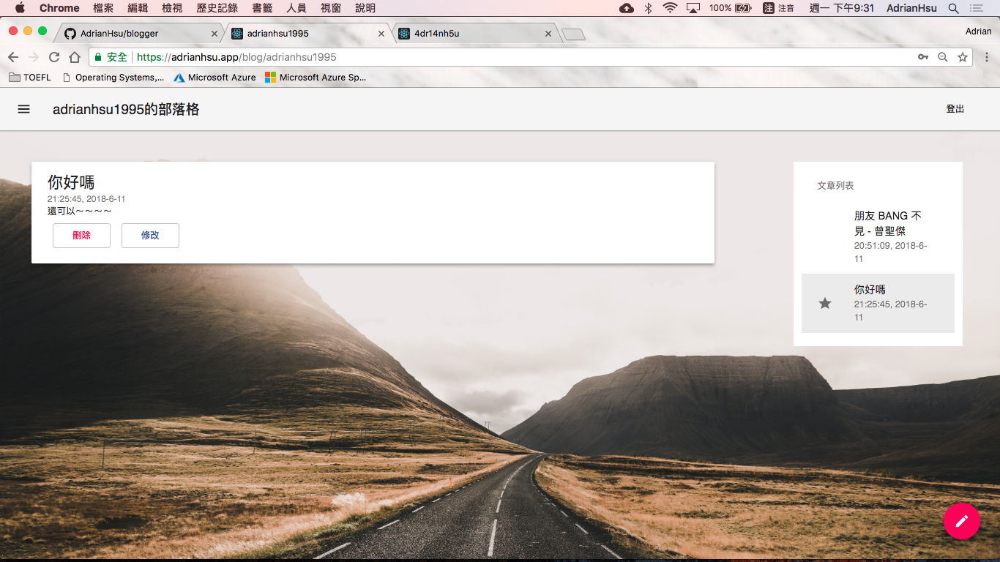

# Blogger

> 🏃 blogger built with Webpack, React-router, React, Express, MongoDB and Node.js


<p align=center>
<a target="_blank" href="https://npmjs.org/package/life-commit" title="NPM version"></a><a target="_blank" href="http://nodejs.org/download/" title="Node version"></a><a target="_blank" href="https://opensource.org/licenses/MIT" title="License: MIT"></a><a target="_blank" href="http://makeapullrequest.com" title="PRs Welcome"></a>
</p>  


- Front-end Framework: **React, React-router, React-dom**
- Front-end Ajax communication: **axios**
- Front-end Web RWD Design: **Material-ui**
- Back-end: **Node.js, Express.js**
- Database: **Mongoose, MongoDB**
- Bundle: **Webpack, Babel**


## How-to

```Shell
$ npm install 
$ npm run build
$ npm run start 

# demo page: http://localhost:3000/
```


## Demo Version

* For **deploy-https** branch: 

  * HTTPS protocol (SSL certificate, listen on 8080 port)

  * nginx back-end server (reverse proxy, port forwarding from 8080 to 443)

    

* For **master** branch: 

  * HTTP protocol (no certificate, listen on 3000 port)


## Directory Tree

```
$ tree .
.
├── README.md
├── package-lock.json
├── package.json
├── public
│   ├── assets
│   │   ├── blog.jpg
│   │   ├── bot.png
│   │   ├── favicon.ico
│   │   ├── login.jpg
│   │   └── signup.jpg
│   ├── index.html
│   └── outputs
│       └── index.js
├── server.js
├── src
│   ├── app
│   │   ├── App.js
│   │   ├── Blog.js
│   │   ├── ButtonAppBar.js
│   │   ├── EditArticle.js
│   │   ├── InsetList.js
│   │   ├── InsetListItem.js
│   │   ├── Login.js
│   │   ├── MenuDrawer.js
│   │   ├── PreviewArticle.js
│   │   ├── SignUp.js
│   │   ├── SimpleDialog.js
│   │   └── index.js
│   ├── models
│   │   ├── Post.js
│   │   └── User.js
│   └── socket
│       ├── PostSocket.js
│       └── UserSocket.js
└── webpack.config.js

7 directories, 28 files
```


## Required global packages

Since that some of my packages are installed **globally**, so you might need to install them yourselves.

```shell
$ npm install -g nodemon@1.17.4
$ sudo yum install -y mongodb-org # version: 3.6
```


## React-router setup

```javascript
const App = (
  <BrowserRouter>
    <Switch>
      <Route exact path="/" component={Login} />
      <Route path="/signup" component={SignUp} />
      <Redirect from="/login" to="/" />
      <Route path="/blog/" component={Blog} />
      <Route path="/blog/:id" component={Blog} />
    </Switch>
  </BrowserRouter>
);

export default App;
```

## Database - CRUD operations

- MongoDB + Mongoose
- `mongoose-unique-validator` to check if the username is already used
- you can download the package through `npm install -S mongoose-unique-validator`


#### 1. C for Create: create posts, users

#### 2. R for Read: get posts 

#### 3. U for Update: update posts (override the original post)

#### 4. D for Delete: remove posts


## Screenshot

1. Login Page: [http://localhost:3000/login](http://localhost:3000/login)


2. Sign Up Page: [http://localhost:3000/signup](http://localhost:3000/signup)


3. Blog: [http://localhost:3000/blog/username](http://localhost:3000/blog/username)




4. Blog (when creating new posts)


5. Blog - Drawer


6. Blog - UserList Dialog


choose who you want to visit. The hostname will be shown in the url, like `/blog/adrianhsu1995`

7. Visit others' blog (cannot write)


## Dependencies

```
  "dependencies": {
    "@babel/cli": "^7.0.0-beta.47",
    "@babel/core": "^7.0.0-beta.47",
    "@babel/plugin-proposal-class-properties": "^7.0.0-beta.47",
    "@babel/preset-env": "^7.0.0-beta.47",
    "@babel/preset-react": "^7.0.0-beta.47",
    "@material-ui/core": "^1.0.0-rc.1",
    "@material-ui/icons": "^1.0.0-rc.0",
    "axios": "^0.18.0",
    "babel-loader": "^8.0.0-beta.2",
    "body-parser": "^1.18.3",
    "express": "^4.16.3",
    "js-sha256": "^0.9.0",
    "mongo": "^0.1.0",
    "mongoose": "^5.1.1",
    "mongoose-unique-validator": "^2.0.1",
    "react": "^16.3.2",
    "react-dom": "^16.3.2",
    "react-markdown": "^3.3.2",
    "react-router-dom": "^4.3.1",
    "webpack": "^4.8.3",
    "webpack-cli": "^2.1.3"
  }
```


#### UserSchema

```javascript
const userSchema = mongoose.Schema({
  username: { type: String, required: true, unique: true }, # adrianhsu1995
  password: { type: String, required: true }, # hihi
  updateTime: Date # ISODate("2018-06-11T08:41:18Z")
});
userSchema.plugin(uniqueValidator); # check username is unique
```

#### MessageSchema

```Javascript
const postSchema = mongoose.Schema({
    title: String, # 你好嗎
    time: String, # "20:23:27, 2018-6-11"
    content: String, # 我很好
    timestamp: String, # "1526819007387"
    hash:String, # QR30X, for identification
    author: String # adrianhsu1995
});
```

## Known Issues

1. it should support facebook login
2. rewrite functions since they're too messy.


## License

MIT License
